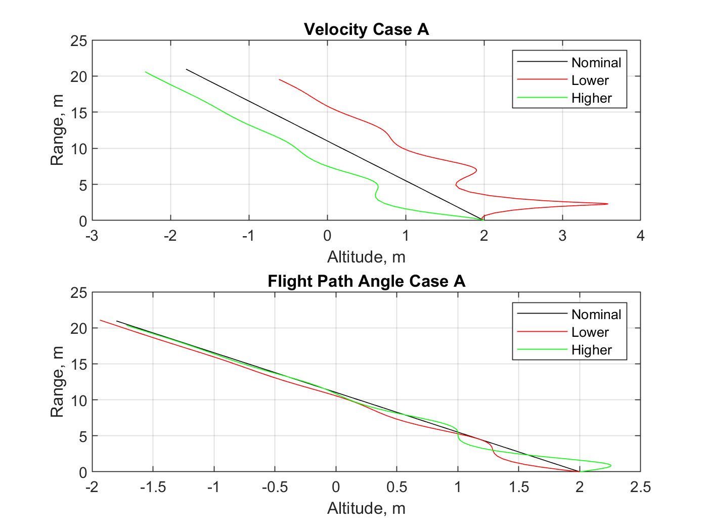

# AEM-3103-final
  # Paper Airplane Numerical Study
  Final Project: AEM 3103 Spring 2024

  - By: Owen Boyle

  ## Summary of Findings

|    Variation    |    Change made    |    Affect on Range    |    Affect on Altitude    |
|:---------------:|:-----------------:|:---------------------:|:------------------------:|
|   adjust V_0    |   Increase V_0    |       Increase        |      overall lower       |
|   adjust V_0    |   Decrease V_0    |       Decrease        |      overall higher      |
| adjust Gamma_0  | Increase Gamma_0  |    Effectively None   |     Effectively None     |
| adjust Gamma_0  | Increase Gamma_0  |    Effectively None   |     Effectively None     |

In this study I found how changing initial conditions affected the outcome of the flight of paper airplane specifically the range and altitude. I
found that changing the initial velocity would directly affect the range of the experiments, meaning an increase in inital velocity meant an increase 
in range. Another observaion was that the paper airplane must've been fairly stable since changing the initial flight path angle wouldn't affect the
range very much at all, this can be seen in the first figure. One last observations is to do with the derivatives of the average of the 100 random
initial condition tests. The airplane seemed to have very similarly scaled range and altitude derivatives. The airplane seemed to have a similarly
damped range and altitude graph as can be seen in the third figure.
 

  # Code Listing

Here is my PaperPlane.m script that I used to create all my plots:
[Link to main script for the paper plane](https://github.com/owenboyle2002/AEM-3103-final/blob/main/PaperPlane.m)

Here is a link to my function for the initial condition variables:
[Initial condition variables function](https://github.com/owenboyle2002/AEM-3103-final/blob/main/setup_sim.m)

Here is a link to the function used for the equations for my initial conditions
[Initial condition equations function](https://github.com/owenboyle2002/AEM-3103-final/blob/main/EqMotion.m)

  # Figures

  ## Fig. 1: Single Parameter Variation
  <2D trajectory simulated by varying single parameter at at time>
  <The above plot should also show the nominal trajectory>

  Briefly describe what is being shown in the figure.

  ## Fig. 2: Monte Carlo Simulation
  <2D trajectories simulated using random sampling of parameters, overlay polynomial fit onto plot.>

  Briefly describe what is being shown in the figure.

 ## Fig. 3: Time Derivatives
 <Time-derivative of height and range for the fitted trajectory>

  Briefly describe what is being shown in the figure.